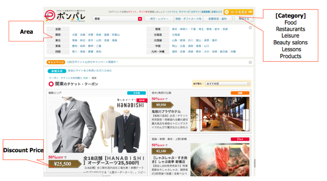
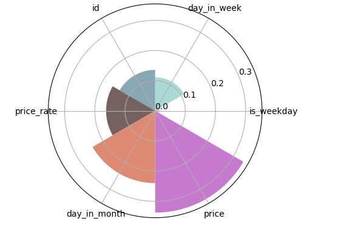

## 项目简介
&emsp;&emsp;本次项目为毕业设计作品，毕业课题为《Python数据分析在机票预订系统中的应用研究》。机票预订系统是课题研究的应用载体，采用B/S架构建站，同时遵循前后端分离原则。前端使用Vue框架，后端使用Django，二者共同配合搭建该系统。课题提出了Python数据分析的四大应用（括号内为实现工具或者算法）：
1. 机票价格最优推荐（排序算法）
2. 机票统计价格可视化（Matplotlib & Echarts）
3. 中转方案推荐（NumPy & Pandas）
4. 优惠券精准投放（sklearn）

&emsp;&emsp;当前项目为后端范畴，前端项目也已经放入仓库，点击乘坐[直通车](https://gitee.com/incline-the-wind/graduate_design_font_end)

> 后端项目为课题的重点，数据获取、数据处理分析、结果分析以及项目部署都在此处讲解

## 项目使用
```bash
# 安装框架
pip install django

# 下面的命令都在要项目根目录下执行

# 前提：配置好了数据库
# 生成数据库，执行成功后可以将数据导入到数据控
python manage.py makemigrations
python manage.py migrate

# 运行
python manage.py runserver 8000
```

## 数据获取
> 对于本课题来说，数据分为两个类型，一个是机票数据，这是系统的“粮食”；第二个是优惠券预测的训练数据，其本身并不贡献于系统的搭建。

### 1. 机票数据
根据项目的需求，这里主要爬取了两部分数据：
1. 机票数据（data/ticket/ticket.csv)
2. 机场数据（data/ticket/airport.csv)
> 以上数据可以直接适配数据库，这里省略了原始数据获取和清洗的过程。

系统必须的额外数据：
1. 用户数据（data/ticket/ticket.csv）
2. 用户预定机票数据（data/ticket/ticket.csv）

> 字段数量和类型可以看ticket应用下的模型类

数据的用途：
- 机票价格最优推荐
- 近期机票价格可视化
- 机票中转推荐
- 用户历史订单
- 用户信息

### 2. 预测模型训练数据
&emsp;&emsp;课题选取来自于Kaggle的Coupon Purchase Prediction比赛所提供的数据。据官网说明，数据是由日本的一家日本国内领先的联合优惠券网站——Recruit Ponpare提供，其网站首页如图6.24所示，它为从小到热瑜伽，大到美食寿司，再到盛夏演唱会门票都提供了很大的折扣。赛题为参赛者提供了该网站22873名用户一年的交易数据，训练数据集的时间跨度从2011年7月1日到2012年6月23日，测试数据集的时间跨度为2012年6月24日到2012年6月30日。数据类型十分丰富，覆盖全面，机票系统用的到只有三个CSV文件——user_list.csv、coupon_list_train.csv、coupon_visit_train.csv。


> 访问官网查看数据更多信息，[点这](https://www.kaggle.com/c/coupon-purchase-prediction)

## 优惠券预测模型
&ensp;&ensp;预测模型是一个简单的二分类问题，目标是预测某用户浏览某价格机票时是否适合投放优惠券，如果投放优惠券有一定概率促进用户的购买，那么就投放一定折扣的优惠券（折扣率尽量最低）。  
提取了六个特征来作为影响因素用户消费的因素，这些特征的详细信息如下： 

<table>
<tr> 
  <th>特征名</th>
  <th>描述</th>
  <th>类型</th>
  <th>长度</th>
  <th>精度</th>
  <th>注释</th>
</tr>
<tr> 
  <td>id</td>
  <td>用户的ID </td>
  <td>number</td>
  <td>10 </td>
  <td>0</td>
  <td></td>
</tr>
<tr> 
  <td>price_rate</td>
  <td>优惠券折扣率</td>
  <td>number</td>
  <td>4</td>
  <td>2</td>
  <td></td>
</tr>
<tr> 
  <td>price</td>
  <td>商品价格</td>
  <td>number</td>
  <td>10</td>
  <td>0</td>
  <td></td>
</tr>
<tr> 
  <td>day_in_month</td>
  <td>月内第几天</td>
  <td>number</td>
  <td>2</td>
  <td>0</td>
  <td></td>
</tr>
<tr> 
  <td>day_in_week</td>
  <td>周几</td>
  <td>number</td>
  <td>2</td>
  <td>0</td>
  <td></td>
</tr>
<tr> 
  <td>is_weekday</td>
  <td>是否是周末</td>
  <td>number</td>
  <td>1</td>
  <td>0</td>
  <td>1：是周末，0：不是周末</td>
</tr>
</table>

&emsp;&emsp;预测模型的训练过程可以进入data/train_model.ipynb查看详细的过程，训练模型在保存在了**rfc.joblib**。评估结果如下：
<table>
<tr> 
  <th>指标</th>
  <th>结果</th>
</tr>
<tr> 
  <td>准确率</td>
  <td>0.9770275669196964 </td>
</tr>
<tr> 
  <td>平均准确率</td>
  <td>85.79320391040163</td>
</tr>
</table>

> 特征重要性的玫瑰图  



## 其他补充
- 其他三大算法都包含在代码在，这里不再赘述
- 后端有部分文件是多余，比如模板文件（html）